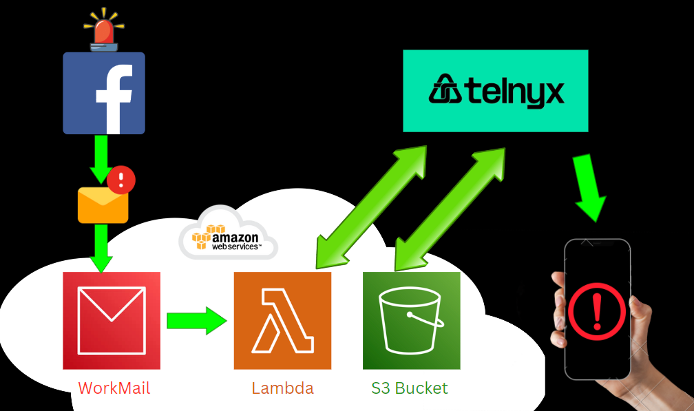
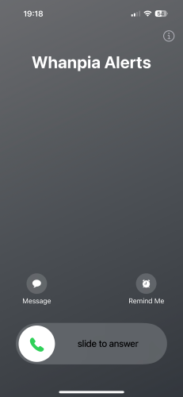
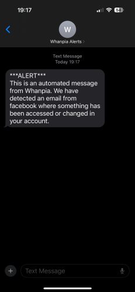
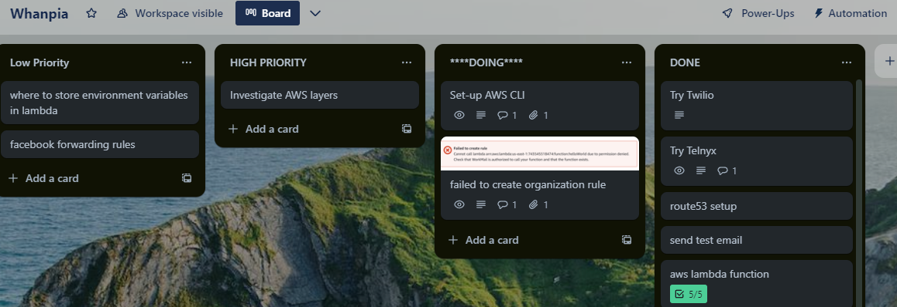
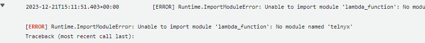
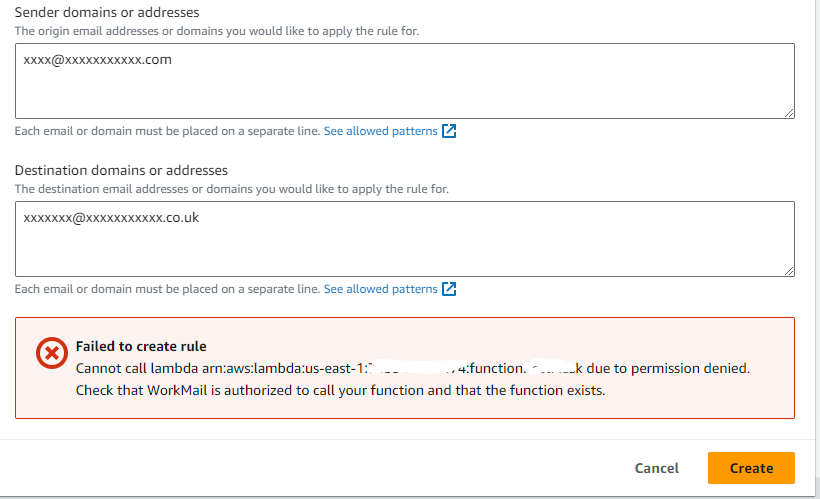
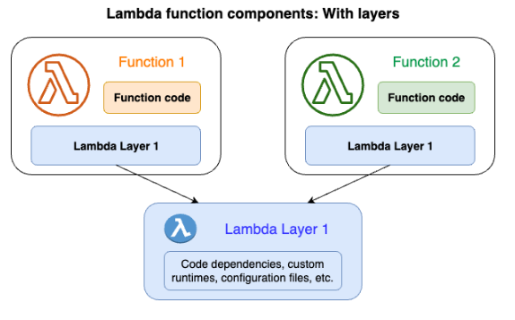

# Whanpia - Call & Message Alert Service

## Contents

[Project Overview](#project-overview) |
[Project Background](#project-background) |
[Getting Started](#getting-started) |
[Testing](#testing) |
[Project Brief & Timeframe](#project-brief) |
[Technologies Used](#technologies-used) |
[Result](#result) |
[Development Lifecycle](#development-lifecycle) |
[Wins](#wins) |
[Challenges](#challenges) |
[Bugs & Future Improvements](#bugs-and-future-improvements) |
[Key Learnings](#key-learnings) |
[Supporting Info](#supporting-info)

# Project Overview

Whanpia is a discrete application hosted on, and leveraging other cloud services of Amazon Web Services (AWS) and Telnyx Communications Platform as a Service (CPaaS). It parses and scans incoming email for keywords or phrases, automatically forwarded from a users email service, which could potentially indicate hacking of their social-media account. It automatically messages & calls the user and plays a pre-recorded audio when the user picks up the call.

<span style="color:red">TIME SAVER ALERT:</span>

This comprehensive README covers both the project and my educational journey. Feel free to reach out for specific information to save time.


Flow of how Whanpia works.

# Project Background

A contact of mine who works in Marketing was subject to repeated facebook account hacks. The attacker accessed my contact's facebook ads manager, launching their own ads spending my contact's customers' money / facebook credit.

The hacks bypassed 2FA and first warning signs were facebook emails recieved from 2am notifying of account changes. We assumed the hacker(s) knew the timezone of my contact; an attack at 2am meant low chance of detection, and adequate time to use facebook ad-spends until detected the next working day.

Although I have limited experience in cybersecurity, I wanted to help out in any way I could. The idea to create the project came after considering possible ways the hack happened, and implementing possible fixes, [see document](additional/response.md)

# Getting Started

To recreate this project please do the following:

## Have pre-requisites

- AWS account
- Telnyx account
- Other [Technologies ](#technologies-used) listed
- Relevant privaledges

## Follow Steps

- In Telnyx account, basic verify, & buy phone number
- Apply for Level II verification (required for UK calls)
- Create Messaging Profile
- Create programmable voice API App
- Create AWS route 53 domain
- Create AWS workmail organization
- Create AWS workmail organization User (email)
- Download the code for logic within the src folder:

```
https://github.com/nedd-ludd/whanpia-alerts/tree/main/src
```

- Clone or download the code for webhooks, and layers on:

```
git@github.com:nedd-ludd/whanpia-alerts-webhook.git
```

```
git@github.com:nedd-ludd/whanpia-alerts-layers.git
```

- Create Lambda Function, choose a name
- Zip & upload "logic" code to AWS Lambda
- Configure permissions for WorkMail/AWS Lambda using AWS CLI
  IAM Policies Lambda Execution role for WorkMail message flow
- Create inbound rule - organisation settings
- Zip & upload packages to AWS Lambda layers
- Link Lambda layer to code
- Create second Lambda Function, choose a name
- Zip & upload "webhook" code to AWS Lambda
- Link Lambda layer to code
- Add API Gateway trigger
- Add API endpoint to Telnyx
- Create AWS S3 Bucket & upload audio
- Configure S3 bucket public access
- In E-mail service provider, forward emails from specific socials email address to service.
- Add Environment Variables in both functions

[Back to Top](#project-overview)

# Testing

- Send an email to WorkMail containing one of the keywords within helpers.py
- Using Amazon CloudWatch, retrieve the messageId and replace the placeholder in below JSON snippet.

```json
  "sender": {
    "address": "sender@domain.test"
  },
  "subject": "Hello From Amazon WorkMail!",
  "messageId": "REPLACE_MSG_ID_HERE",

```

- Within the lambda function page, select the "Test" tab.
- Create new test event and give name.
- Enter the complete JSON from "ref.md"
- Within lambda_function.py change test to True:

```
test = False   ----> test = Talse
```

If test = True, the TESTER environment variable (telephone number) will be the recipient. This requires returning to False and then the CUSTOMER will receive notifications.

[Back to Top](#project-overview)

# Project Brief

The brief was self generated from an end user "must-have" of **needing to know when they are being hacked**. Combined with my personal goal, the requirements, and delivereables were as follows:

## Personal Goal

My overarching goal for this project was:

_"Educate myself in AWS cloud computing & online Communications Platforms, by creating a Python-based alert system, triggered by email notifications, helping assist with cybersecurity incident response."_

## Functional Requirements

- Receive & scan content from social media email notifications.
- If certain indicators present, run code to:
  - Send notification text.
  - Make a notification call.

## Non-Functional Requirements

- Codebase hosted on AWS.
- Use a CPaaS to call and message.
- Use AWS Lambda for function logic.
- Leverage any other AWS services needed.
- Codebase & README on GitHub repo.

## Deliverables

- A README.md for the project covering:
  - The Whats, Whys, and Hows.
  - Key/ Important details.
  - Approach & Methods.
  - The Results.
  - What was learned.
  - What went well/ not well.
  - How to recreate.
- Instructions for end-user receiving the call.

## Nice-to-haves

Considering the alert call could come when the end-user was asleep, I thought it helpful to play a funny/ light-hearted audio on the notification call.

## Timescale

Timescale I gave myself was "open ended" although it took roughly 60 hours over three weeks.

[Back to Top](#project-overview)

# Technologies Used

<table>
  <thead>
    <tr>
      <th>Type</th>
      <th>Technology</th>
    </tr>
  </thead>
  <tbody>
    <tr>
      <td style="border-bottom: 1px solid #ddd;">Operating Systems</td>
      <td style="border-bottom: 1px solid #ddd;">
        <ul>
          <li>Linux</li>
          <li>Windows</li>
        </ul>
      </td>
    </tr>
    <tr>
      <td style="border-bottom: 1px solid #ddd;">Languages / Formats / Packaging</td>
      <td style="border-bottom: 1px solid #ddd;">
        <ul>
          <li>Python</li>
          <li>JSON</li>
          <li>pip</li>
          <li>pip env</li>
        </ul>
      </td>
    </tr>
    <tr>
      <td style="border-bottom: 1px solid #ddd;">Amazon Web Services (AWS)</td>
      <td style="border-bottom: 1px solid #ddd;">
        <ul>
          <li>Route 53</li>
          <li>Amazon WorkMail</li>
          <li>Lambda</li>
          <li>S3</li>
          <li>IAM</li>
          <li>CloudWatch</li>
          <li>API Gateway</li>
        </ul>
      </td>
    </tr>
    <tr>
      <td style="border-bottom: 1px solid #ddd;">Telnyx</td>
      <td style="border-bottom: 1px solid #ddd;">
        <ul>
          <li>Numbers</li>
          <li>Messaging</li>
          <li>Voice</li>
        </ul>
      </td>
    </tr>
    <tr>
      <td style="border-bottom: 1px solid #ddd;">Code Editors</td>
      <td style="border-bottom: 1px solid #ddd;">
        <ul>
          <li>Visual Studio Code</li>
          <li>AWS Lambda web-based editor</li>
        </ul>
      </td>
    </tr>
    <tr>
      <td style="border-bottom: 1px solid #ddd;">Misc</td>
      <td style="border-bottom: 1px solid #ddd;">
        <ul>
          <li>Chrome</li>
          <li>Facebook</li>
          <li>ChatGPT</li>
        </ul>
      </td>
    </tr>
    <tr>
      <td style="border-bottom: 1px solid #ddd;">Project Management / Version Control</td>
      <td style="border-bottom: 1px solid #ddd;">
        <ul>
          <li>Trello</li>
          <li>GitHub</li>
        </ul>
      </td>
    </tr>
  </tbody>
</table>

[Back to Top](#project-overview)

# Result

<table>
  <thead>
    <tr>
      <th>Forwarded Trigger Email</th>
      <th>Call & Audio</th>
      <th>Text Notification</th>
    </tr>
  </thead>
  <tbody>
    <tr>
      <td align="center">
        
      </td>
      <td align="center">
        
      </td>
      <td align="center">
        
      </td>
    </tr>
  </tbody>
</table>

The phrase "someone may have accessed" triggers a lambda function, calling the telnyx API, which calls and texts, and plays audio.

Listen to [Audio by Snoop Dogg using speechify](https://snoop-safe.s3.amazonaws.com/snoop-safe.mp3)

_"What-up \<recipient name>! Snoop D O double-g here. I've noticed some suspicious-a\*\* s\*\*\* goin on wit yow account, wondered if you could check that s\*\*\* out. Peace!"_

[Back to Top](#project-overview)

# Development Lifecycle

The process I followed involved an initial planning phase, and then execution, with general methodology applied.

## Planning

- Investigating available technologies
- De-risk the project byreviewing with my contact if that was acceptable.
- Once "approved" consider what the MVP was, this excluded playing audio
- Set up kanban board.
- Set up folders.
- Follow iterative development process, through to attaining MVP.
- Complete lower priority which was playing audio.

### General Approach

- Used Trello for kanban board, listing & updating tasks to monitor project progress. If any problems arose, new cards were created and worked through:
  
- Keeping notes to refer back to, which aid the write up, and also help pick things up if they have been parked for any period.
- Allowing adequete time to research as project progressed.
- Breaking large problems into smaller.
- Aborting work and trying different ways.

## Debugging / Testing

- Where possible I tried to use a "Hello World" exercise for each new implementation.

- Testing/ debugging code as far as practicable, both locally for parts of functions, but given no local AWS testing environment was set up, once code deployed to lambda, debugging took the form of reading AWS CloudWatch logs:
  

[Back to Top](#project-overview)

## Execution

The successful order of development was the same as listed in the [Getting Started](#getting-started) section but not step will be covered in detail.

I will expand upon some steps, cover what I consider notworthy failures or interesting points, as well as snippets of code.

Due to an unknown route and educational emphasis, there were a lot of experiments, failures, and dead-ends. The result was a number of abortive efforts exercises, all won't all be mentioned.

### Communications Platform Selection

I knew of two platforms; Twilio and Telnyx, that could be used so investigated both.

Unfortunately, I was unable to even use the Twilio service due to verificaton issues. Before even using the account I was suspended and had to provide, and re-provide details of identity and use which was expected. After that I was stuck in a loop of providing details of use and identity on their "get-started" form.

The information required by Telnyx was the same, although the journey seemed to flow a lot better. For their service to contact UK based numbers, there was an extra level of verification required.

I assume the steps required, and exchange of confirmation emails are to stop programmatic signup and automated mis-use of services.

### Code Logic

#### Telnyx

The Programmable Voice API was utilised enabling control of call flow, as well as the SMS/MMS API for text-message.

The code is highly abstracted, and was very easy to implement:

```python
import telnyx

telnyx.api_key = "KEYXXXXXXXXXXXXXXXXXXXXXXXXXXXXXXXXXXXXXXXXXXXXXXXXXXXXXXX"

alert_service_number = "+XXXXXXXXXXXX"
resp = telnyx.Message.create(
    from_="+XXXXXXXXXXXX",
    to="+XXXXXXXXXXXX",
    text=f"test text content",
)

telnyx.Call.create(connection_id="XXXXXXXXXXXXXXXXXXX",
                   from_="+XXXXXXXXXXXX",       to="+XXXXXXXXXXXX",)

```

#### Return Webhook

A placeholder was put in telnyx service which was mandatory, then replaced with official API gateway endpoint when created.

When recipient answers the call, telnyx will send a request to the API gateway endpoint. Within the request JSON payload, an event type of "call.answered" will be present.

```python
    event_type = event["data"]["event_type"]
    if event_type == "call.answered":
        call_id = event["data"]["payload"]["call_control_id"]
        call = telnyx.Call.retrieve(call_id)
        # Call has been answered
        audio_url = "https://xxxxxxxxxxxxxxxxxxxxxxxxxxxxxxxxxx.mp3"
        call.playback_start(audio_url=audio_url)
```

The call_id is also within the JSON and can be used to create an object for the call. The method "playback_start" is then used to play audio.

#### Telnyx Bug

There was a known issue with Telnyx relying on an outdated "six" python module. This was resolved by pipenv install six and including with package.

#### Boto3 - SDK for Python

The following code was leveraged for lambda to access workmail.

```python
import boto3
import email
import os

def email_handler(event, context):
    workmail = boto3.client('workmailmessageflow')
    msg_id = event['messageId']
    raw_msg = workmail.get_raw_message_content(messageId=msg_id)

    parsed_msg = email.message_from_bytes(raw_msg['messageContent'].read())
    return parsed_msg
```

#### RegExp from ChatGPT

The Regex used was generated by ChatGPT, to take a list of keywords, and return a boolean of matches variable to indicate email content might mean account access.

```python
    pattern = re.compile(
        r'\b(?:' + '|'.join(map(re.escape, keywords)) + r')\b', re.IGNORECASE)

    matches = pattern.findall(email_content)
```

### Amazon Web Services

#### Operations and Configurations

Most of the project was conducted using the AWS Console, a web-based interface. I was unfamiliar with how to provision and configure services at first, but platform became familiar and easy to use with time. I followed a lot of the documentation, some of the key links of this are provided in the supporting.md file in this repo.

For permissions and policies, there were readily available out-of-the-box JSON examples, I used these with modifying account ID, and Amazon Resource Name (ARN) where needed. Please see the ref.md document in this repo.

#### AWS CLI

In order to allow Lambda to be triggered, an inbound rule needed to be set up in WorkMail organization settings. This could not be done before permissions were set, which required use of AWS CLI.



I downloaded for Windows, installed, and in a terminal performed a "Hello World" equivalent with:

```
aws --version
```

To change permissions I entered my account ID, and Keys, then used code from "Configure permissions for WorkMail" in ref.md.

#### Lambda Function Size

With growing codebase size, I reached the lambda function limits of 3MB for being able to view code in editor, and then 50MB for direct .zip upload limit.

Editing code locally, then rezipping/ uploading to S3, then telling lambda to use S3 bucket was not an efficient workflow. It was also impractical to not view code online. This lead to discovery of and research into Lambda Layers.

#### Packaging Lambda Layers & Version

Due to lambda being on a linux server, packaging dependencies became an issue in some cases, when main function was trying to find the modules to import.

I also initially used seperate layers for Telnyx and Boto3 which caused dependency hell on some modules.

A linux machine was then used to create a pipenv, install all packages (dependencies automatically resolved), then package using the code using a bash script in ref.md

The package was then zipped in a folder directory, AWS requires:

```
python/lib/python3.x/site-packages
```

### Seperation of Concerns

#### Modularisation

Although very small code base, I started to modularise code for clarity. The helpers, ingest_email, and telnyx .py files help ensure cleanliness. And although the project is MVP grade, the seperation would allow further development.

#### Accepting Webhooks

Initially I investigated Flask as a way to generate and endpoint to include within main code. This would of still required an API gateway endpoint and potentially complicated the main function.

I made the decision to have a seperate lambda function to receive Telnyx requests and play audio. This did not require flask. Also, this is one of the key use cases for Lambda/ Lambda Layers "to share dependencies across multiple functions", implementing DRY:


[Back to Top](#project-overview)

# Wins

- My educational [GOAL](#project-goals) was achieved!
- Requirements and deliverables met/ produced.
- I got something working quickly, and crudely, then improved.
- Working in an unfamiliar landscape with new technologies.
- Enjoyed the project; found it hard to "log-off" and take a break.
- Contact was very happy with the result - they even said "I kinda want to be hacked again now so I can hear Snoop Dogg!"

# Challenges

Working with Unfamiliar Technologies - Unfamiliar technologies, solved by approach, breaking things down, aborting work

Testing locally - There was provision to test the composed program.

Development Operating System - I work mostly from a Windows machine although have been learning Linux and have Linux on an old Laptop. There were the mentioned problems with creating packages but jumping across two machines wasn't ideal.

Packaging and deployment - encountered depencency hell with not using proper dependency management. Before using layers unable to see code, and initially went "long way round" with repeatedly uploading code, checking cloud watch log for errors.

Use of GUI - Although probably the best way to be introduced to AWS, the use of online console proved to be challenging to constantly re-upload, configure, and manage the relationships between parts. The workflows could be more streamlined.

[Back to Top](#project-overview)

# Bugs and Future Improvements

- Sometime sends more than one text, perhaps due to multi-part emails.

Improvements:

- Keep calling till pick up, customer may sleep through calls.
- How to add "caller ID" - name of "Whanpia Alerts"
- Code could be cleaned up, commented better.
- Did the project as root user in AWS - this is VERY BAD PRACTICE, must employ "least privileges" with new user.
- Testing regime changes, could do better than hardcoding "test" mode.
- Need testing set up for webhook endpoint.
- Implement better logging - simple print() outputs to CloudWatch, ok for dev.
- Local development, testing, and deploy with AWS SAM.
- Perhaps would have benefitted from docker.
- Use Windows Subsystem For Linux to package layers or just throw away Windows Machine when can afford mac.
- Use GitHub from start to ensure code was backed up other than local.

# Key Learnings

- Deepened understanding of Cyber Secutiry.
- Deepened knowledge of AWS services, their functions and uses.
- Learning about Communications Platform as a Service (CPaaS)
- Helped understand about emails, what's actually in them.
- Awareness of unknowns that could benefit future projects

# Supporting Info

Here is a [link to file](additional/supporting.md) to file containing all the supporting docs/articles/videos etc that guided me along to create this project.

[Back to Top](#project-overview)
