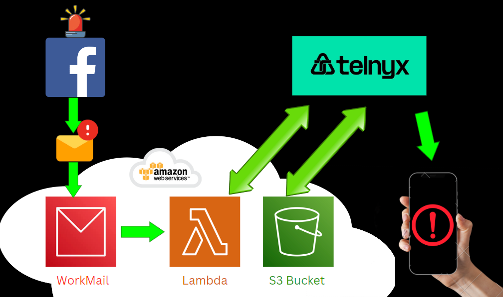
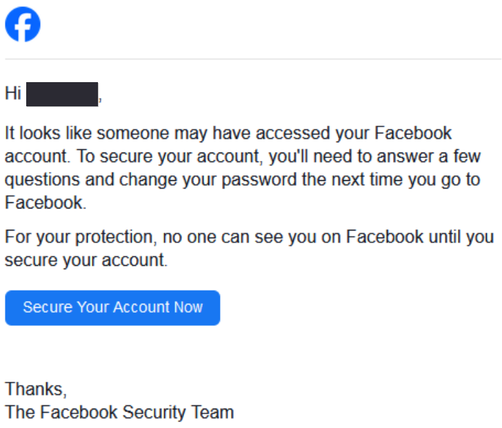
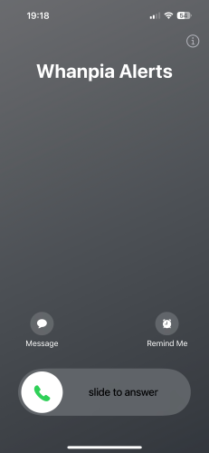
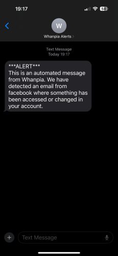

# Whanpia - Call & Message Alert Service

[Project Overview](#project-overview) | [Project Background](#project-background) | [Getting Started](#getting-started) | [Project Brief and Timeframe](#project-brief-and-timeframe) | [Technologies Used](#technologies-used) | [Demonstration](#demonstration) | [Process](#process) | [Wins](#wins) | [Challenges](#challenges) | [Bugs & Future Improvements](#bugs--future-improvements) | [Key Learnings](#key-learnings) | [References](#references)

**N.B.**: This README is fairly comprehensive; if you don't have time to read it all, please message me.

???rewrite above.

# Project Overview

Whanpia is a discrete application hosted on, and leveraging cloud services of AWS and Telnyx online Calling/ Messaging platform. It parses and scans an incoming email for keywords or phrases, automatically forwarded from a users email service, which could potentially indicate hacking of their social-media account. It automatically messages & calls the user and plays a pre-recorded audio when the user picks up the call.



# Project Background

A contact of mine who works in Marketing was subject to repeated facebook account hacks. The attacker accessed my contact's facebook ads manager, launching their own ads spending my contact's customers' money / facebook credit.

The hacks bypassed 2FA and first warning signs were facebook emails recieved from 2am notifying of account changes. We assumed the hacker(s) knew the timezone of my contact; an attack at 2am meant low chance of detection, and adequte time to use facebook ad-spends until detected the next working day.

Although I have limited experience in cybersecurity, I wanted to help out in any way I could.

# Getting Started

## Pre-requisites

- AWS account
- Telnyx account
- Other [Technologies ](#technologies-used) listed

## Steps for recreation

- Create Telnyx account, verify, & buy phone number
- Apply for Level II verification (required for UK calls)
- Create Messaging Profile
- Create programmable voice API App
- Clone or download the code for logic, webhooks, and layers on:

```
git@github.com:nedd-ludd/whanpia-alerts.git
```

```
git@github.com:nedd-ludd/whanpia-alerts-webhook.git
```

```
git@github.com:nedd-ludd/whanpia-alerts-layers.git
```

- Create AWS route 53 domain
- Create AWS workmail organization
- Create AWS workmail organization User (email)
- IAM???
- Create Lambda Function with \<name>
- Zip & upload "logic" code to AWS Lambda
- Configure permissions for WorkMail/AWS Lambda using AWS CLI
- Create inbound rule - organisation settings
  add emails to inbound rule?

<mark>what about the emails from facebook for CONTACT NAME</mark>

- Zip & upload packages to AWS Lambda layers
- Link Lambda layer to code
- Create second Lambda Function with \<name>
- Zip & upload "webhook" code to AWS Lambda
- Link Lambda layer to code
- Add API Gateway trigger
- Add API endpoint to Telnyx
- Add API keys & phone numbers in both Lambda functions
- Create AWS S3 Bucket & upload audio
- Configure S3 bucket public access -was this IAM???
- In E-mail service provider, forward emails from specific socials email address to service.
- Add environment variables

# Testing

- Send an email to WorkMail containing one of the keywords within helpers.py
- Using Amazon CloudTrail, retrieve the messageId and replace the placeholder in below JSON snippet.

```json
  "sender": {
    "address": "sender@domain.test"
  },
  "subject": "Hello From Amazon WorkMail!",
  "messageId": "REPLACE_MSG_ID_HERE",

```

- Within the lambda function page, select the "Test" tab.
- Create new test event and give name.
- Enter the complete JSON from "incoming_mail_test.json"
- Within lambda_function.py change test to True:

```
test = False   ----> test = Talse
```

If test = True, the TESTER environment variable (telephone number) will be the recipient. This requires returning to False and then the CUSTOMER will receive notifications.

# Project Goals

My overarching goal for this project was:

_"Educate myself in AWS cloud computing & online Telephone services, by creating a Python-based alert system, triggered by email notifications, helping assist with cybersecurity incident response."_

## Planning / brief / response / ideas

Once it was decided to create software to help..see below..., I was able to generate a brief

Self Brief
Use a Telephone/ Messaging platform.
Leverage AWS Cloud computing services.

## Technical Requirements

- Receive & scan content from social media email notifications.
- If certain indicators present, run code to:
  - Send notification text.
  - Make a notification call.
  - Play funny/ light-hearted audio on notification call

## Deliverables

- Codebase hosted on AWS.
- Instructions for end-user.
- Codebase deployed to GitHub repo.
- A README.md for the project:
  - The Whats, Whys, and Hows.
  - Key/ Important details.
  - Approach & Methods.
  - The Results.
  - What was learned.
  - What went well/ not.
  - How to recreate.

# Technologies Used

<table>
  <thead>
    <tr>
      <th>Type</th>
      <th>Technology</th>
    </tr>
  </thead>
  <tbody>
    <tr>
      <td style="border-bottom: 1px solid #ddd;">Operating Systems</td>
      <td style="border-bottom: 1px solid #ddd;">
        <ul>
          <li>Linux</li>
          <li>Windows</li>
        </ul>
      </td>
    </tr>
    <tr>
      <td style="border-bottom: 1px solid #ddd;">Languages / Formats / Packaging</td>
      <td style="border-bottom: 1px solid #ddd;">
        <ul>
          <li>Python</li>
          <li>JSON</li>
          <li>pip</li>
          <li>pip env</li>
        </ul>
      </td>
    </tr>
    <tr>
      <td style="border-bottom: 1px solid #ddd;">Amazon Web Services (AWS)</td>
      <td style="border-bottom: 1px solid #ddd;">
        <ul>
          <li>Route 53</li>
          <li>Amazon WorkMail</li>
          <li>Lambda</li>
          <li>S3</li>
          <li>IAM</li>
          <li>CloudTrail</li>
          <li>API Gateway</li>
        </ul>
      </td>
    </tr>
    <tr>
      <td style="border-bottom: 1px solid #ddd;">Telnyx</td>
      <td style="border-bottom: 1px solid #ddd;">
        <ul>
          <li>Numbers</li>
          <li>Messaging</li>
          <li>Voice</li>
        </ul>
      </td>
    </tr>
    <tr>
      <td style="border-bottom: 1px solid #ddd;">Code Editors</td>
      <td style="border-bottom: 1px solid #ddd;">
        <ul>
          <li>Visual Studio Code</li>
          <li>AWS Lambda web-based editor</li>
        </ul>
      </td>
    </tr>
    <tr>
      <td style="border-bottom: 1px solid #ddd;">Misc</td>
      <td style="border-bottom: 1px solid #ddd;">
        <ul>
          <li>Chrome</li>
          <li>Facebook</li>
          <li>ChatGPT</li>
        </ul>
      </td>
    </tr>
    <tr>
      <td style="border-bottom: 1px solid #ddd;">Project Management / Version Control</td>
      <td style="border-bottom: 1px solid #ddd;">
        <ul>
          <li>Trello</li>
          <li>GitHub</li>
        </ul>
      </td>
    </tr>
  </tbody>
</table>

# Result

<table>
  <thead>
    <tr>
      <th>Forwarded Trigger Email</th>
      <th>Call & Audio</th>
      <th>Text Notification</th>
    </tr>
  </thead>
  <tbody>
    <tr>
      <td align="center">
        
      </td>
      <td align="center">
        
      </td>
      <td align="center">
        
      </td>
    </tr>
  </tbody>
</table>

Listen to [Audio by Snoop Dogg using speechify](https://snoop-alert.s3.amazonaws.com/snoop.mp3)

_"What-up \<recipient name>! Snoop D O double-g here. I've noticed some suspicious-a\*\* s\*\*\* goin on wit yow account, wondered if you could check that s\*\*\* out. Peace!"_

# Process

Without delay I wanted to investigate what the original problem was, try to help where possible at fixing. Then moved on to considering software to help.

## Fixes

Investigate attack, Implement any fixes.
Investigate avilable Technologies.

Investigate original vunreability. The exact vunerability was difficult to identify.
visibility and support from facebook.
pinpoint the vunerability
Initial research returned the possibility of cookie theft, which could of explained the bypass of 2FA.
Alternatively, the users gmail account could be compromised.
Sources of this could include malware accidentally installed, or malicious google extensions.

review google logons
review facebook logins
log out of all sessions
make a copy of all logons on passwords using password manager
reinstall macOS
reset passwords from different machine

There was also the potential for the vunerability to be facebook-side, and if this was the case, we needed a last line of defence to spot suspicious activity or a hack as its happening.

This led to the idea of an automated call / message service that could contact the user at any hour. If the alert number was added to iPhone emergency contacts, calls could come through even if phone was in sleep or work mode.

If a hacker had logged on, ad-spend for facebook ads manager could be monitored or temporarily deactivated. As well as alerting facebook to the activity.

## Planning

Investigates available technologies
Had a rough idea of what services could be used, Twilio, Telnyx, AWS Lambda

## General

De-risked - went for key functional parts and tested locally
testing as went so far as possible
keeping notes
using trello to track work
<mark>screen shot of trello</mark>
spending time researching problems as they occur

## Debugging / Testing

Telnyx Locally

## Execution

The successful order of development was the same as listed in the [Getting Started](#getting-started) section. However due to uknown route and educational emphasis, a lot of experimentation, failure, and dead-ends were experienced, meaning there was alot of abortive work not mentioned.

Salient points, chat gpt, seperation of logic like code functions, endpoint like microservices

Code snippets that I find interesting or believe to be important are included.

There are also mentions of the key failures.

# Code Snippets

```
REGION=?
MY_FUNCTION_NAME=?
REGION=?
AWS_ACCOUNT_ID=?
WORKMAIL_ORGANIZATION_ID=?

```

```bash
aws --region REGION lambda add-permission --function-name MY_FUNCTION_NAME
--statement-id AllowWorkMail
--action "lambda:InvokeFunction"
--principal workmail.REGION.amazonaws.com
--source-arn arn:aws:workmail:REGION:AWS_ACCOUNT_ID:organization/WORKMAIL_ORGANIZATION_ID
```

# Wins

Goal ultimately achieved?
Got something working quickly, and crudely
Unfamiliar ??landscape, field
Learnt alot and really enjoyed the project
Contact was very happy with the result

# Challenges & Solutions

Unfamiliar technologies, solved by approach, breaking things down, aborting work

## Finding Technologies

Was originally going to use Twilio, couldnt get verified, used Telnyx
Hard to get approval for UK numbers - probably to do with amount of scam calls.

## Testing Locally

## Packaging and deployment

unable to see code, initially went "long way round" with repeatedly uploading code, checking cloud watch log for information.
Size of code and deployment, S3 Bucket
Telnyx six
Packaging, dependency, python versions, tried seperate layers, solved by creating a virtual env and using this script......

Telnyx docs not entirely clear, trial and error
Return Webhooks, make code complicated, seperation of concerns and make another lambda function

## Use of GUI

# Bugs / Future Improvements / Could of done Better

Keep calling till pick up
Windows Subsystem For Linux or just throw away Windows Machine
Logging
Testing
Local testing using??
CI/CD
AWS SAM

# Key Learnings

Basic understanding of Cyber Secutiry.

Familiarity with AWS services, their functions and potential uses.

Could of used GitHub to start with to ensure code was backed up other than local.
Used AWS root user,

# References

<mark>add file and link</mark>

Here is a LINK to file containing all the supporting docs/articles/videos etc that guided me along to create this project.
